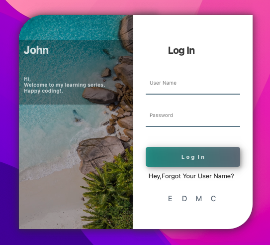

# Happy Coding

I recently tried out Qt with Python, and it’s been a truly exciting experience! This project is a simple PyQt5 application that showcases a translucent login form interface. The application allows users to enter their username and password and features a modern, stylish design.



## Features
- **Translucent Background**: The window has a frameless and translucent background for a sleek look.
- **Responsive Design**: The layout adjusts nicely to different window sizes.
- **Stylish Buttons**: Buttons have hover and pressed effects for a better user experience.
- **Social Media Integration**: Includes buttons for social media login options.
- **User-Friendly Interface**: Clear placeholder text and informative labels guide the user.

## Getting Started

### Prerequisites
Make sure you have the following installed:
- Python 3.x
- PyQt5

### Installation
1. Clone the repository or download the files.
2. Install the required packages:
   ```bash
   pip install PyQt5
   ```

### Running the Application
To run the application, execute the following command in your terminal:
```bash
python main.py
```

Replace `main.py` with the name of your Python file if it's different.

## Acknowledgments
- Special thanks to the PyQt5 community for their resources and support!

Happy coding!
